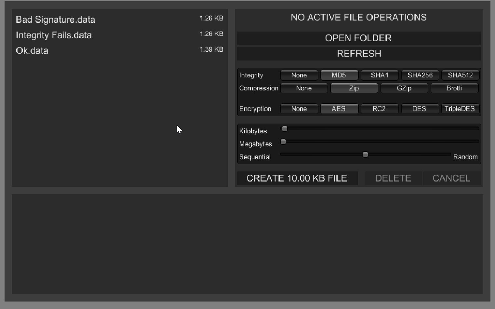

<p align="center"></p>
<p align="center"><b>Async Load/Save Local Data With Compression, Encryption And Integrity Check</b></p>
<br>

<p align="center">
  <a style="text-decoration:none">
    
  </a>  
  <a style="text-decoration:none">
    
  </a>
  <a style="text-decoration:none">
    
  </a>
  <a style="text-decoration:none">
    
  </a>
</p>

'**Local Data**' is a module of '**Game:Work**' dedicated to read and write local files asynchronously.

## Features 🎇

* Fully asynchronous read, load and cancel.<br>
* Integrity check using MD5, SHA-1, SHA-256 or SHA-512 algorithms.<br>
* Compression / decompression using algorithms: GZip, Zip or Brotli.<br>
* Encryption / decryption using algorithms: AES, DES, RC2, DES or TripleDES.<br>
* Supports typical Unity data such as: Vector, Quaternion, Color, etc.

## Requisites 🔧

- Unity 2020.3 or higher.
- [Game:Work Core](https://github.com/FronkonGames/GameWork-Core).
- [Game:Work Foundation](https://github.com/FronkonGames/GameWork-Foundation).
- Test Framework 1.1.31 or higher.

## Installation 📦️

### Editing your 'manifest.json'

- Open the manifest.json file of your Unity project.
- In the section "dependencies" add:

```c#
{
  ...
  "dependencies":
  {
    ...
    "FronkonGames.GameWork.Modules.LocalData": "git+https://github.com/FronkonGames/GameWork-Local-Data.git",
    "FronkonGames.GameWork.Core": "git+https://github.com/FronkonGames/GameWork-Core.git",
    "FronkonGames.GameWork.Foundation": "git+https://github.com/FronkonGames/GameWork-Foundation.git"
  }
  ...
}
```

### Git

First clone the dependencies inside your Assets folder:

```
git clone https://github.com/FronkonGames/GameWork-Foundation.git

git clone https://github.com/FronkonGames/GameWork-Core.git
```

Then clone the repository:

```
git clone https://github.com/FronkonGames/GameWork-Local-Data.git
```

## Use 🚀

Create a class inheriting from ILocalData and add the attribute _Serializable_:

```c#
[Serializable]
public class MyLocalData : ILocalData
{
  public string Signature => "MySignature";
  
  public string playerName = "Guybrush Threepwood";
  
  public Vector3 position = new(0.0f, -10.0f, 0.0f);
}
```

To serialize it in the file '_Guy.brush_':

```c#
localDataModule.Write(myLocalData, "Guy.brush", null, (result) =>
{
  if (result == FileResult.Ok)
    Debug.Log("Guybrush Threepwood saved!");
  else
    Debug.Error($"{result} writing 'Guy.brush'.");
});
```

To deserialise the file '_Guy.brush_' into an object:

```c#
MyLocalData myLocaldata = null;

localDataModule.Read<MyLocalData>("Guy.brush", null, (result, file) =>
{
  if (result == FileResult.Ok)
    myLocalData = file;
  else
    Debug.Error($"{result} reading 'Guy.brush'.");
});
```

## License 📜

Code released under [MIT License](https://github.com/FronkonGames/GameWork-Scene-Module/blob/main/LICENSE).